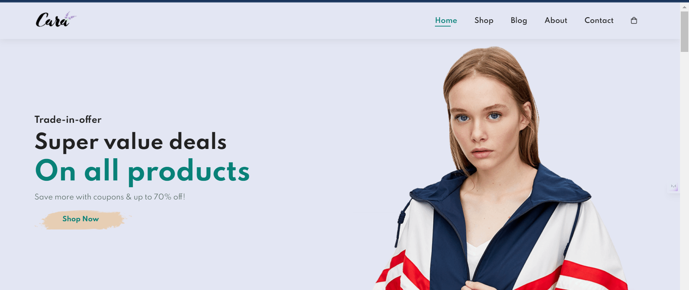
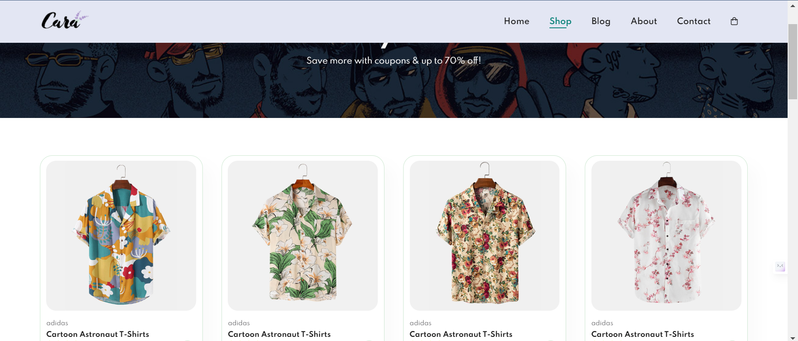
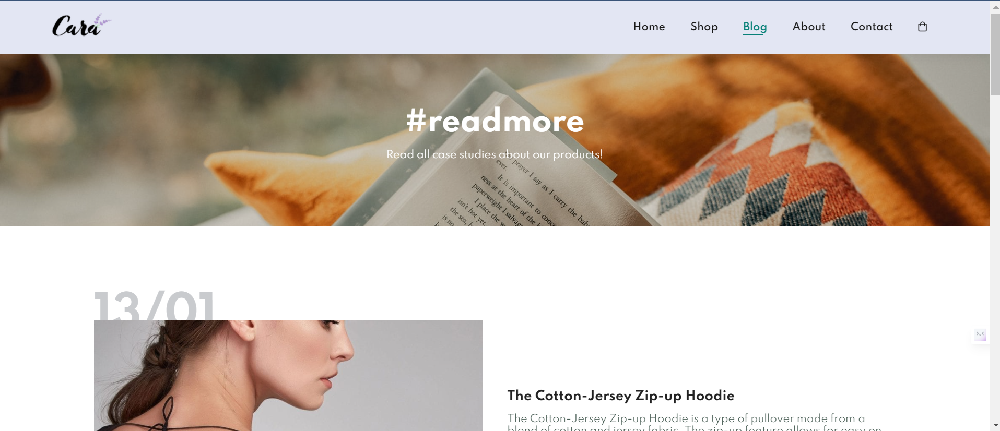
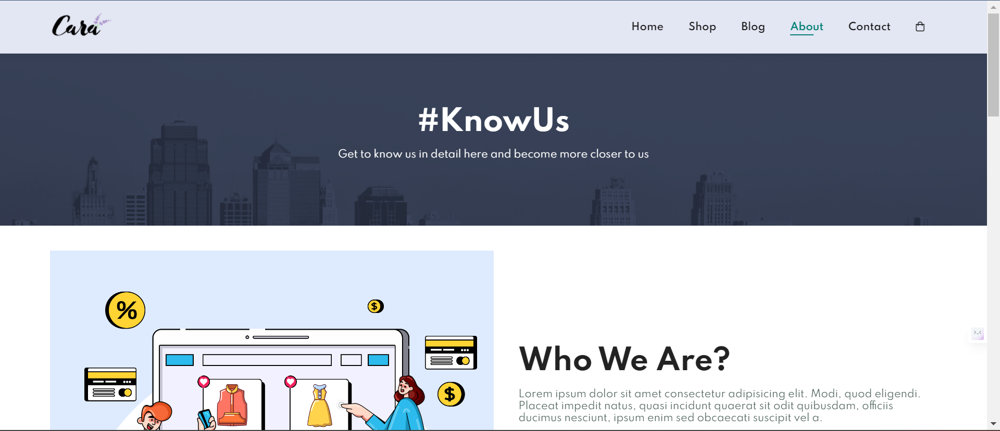
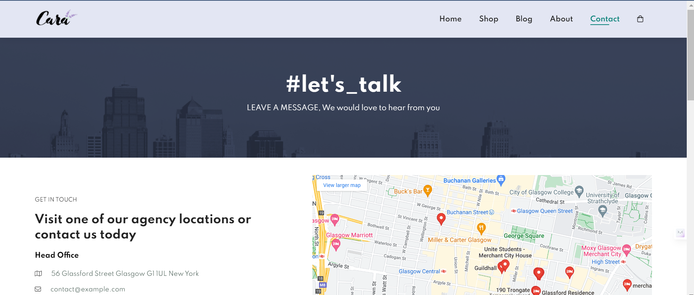
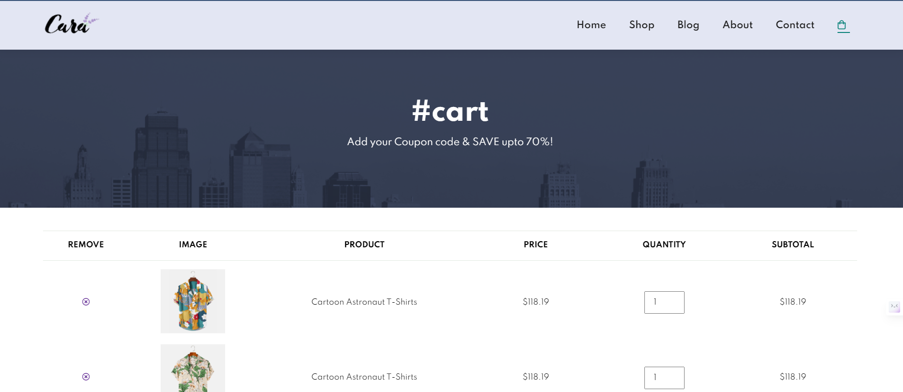

# Responsive_E-Commerce_Website

A responsive E-commerce Website is a Simple E-commerce Website that will be responsive in other Media also.

## About Project

This Project is a Simple E-commerce Website that is created by using HTML, CSS, and JavaScript. While making each webpage responsive other media also.
This Website is a collection of different web pages which are:

HomePage
ShopPage
BlogPage
AboutPage
ContactPage
CartPage


The website has been designed keeping the user experience in mind and it's easy to navigate through


Here you can see all the products available on the platform, you can filter them by category or search


A Blog page where users can read about new products, trends or anything they want.


An About Us section that gives information about who we are and what we do.


A Contact Us form where users can get in touch with us.


A Shopping Cart where users can view their items before making a purchase.

<div class="container"></div>
As this project is made using HTML & CSS, it becomes fully responsive on various devices like iPhones, iPads, etc.
You can see how this website looks on various devices such as Desktop, Tablet & Mobile

This Site is a Simple Structure of the E-commerce Site

## Geeting Started

Cloning a repository

1. On GitHub.com, navigate to the main page of the repository.

2. Above the list of files, click <>Code.

3. Copy the URL for the repository.
<ul>

- To clone the repository using HTTPS, under "HTTPS".

- To clone the repository using an SSH key, including a certificate issued by your organization's SSH certificate authority, click SSH.

- To clone a repository using GitHub CLI, click GitHub CLI.
</ul>

7. Open Git Bash.

8. Change the current working directory to the location where you want the cloned directory.

9. Type git clone, and then paste the URL you copied earlier.

```
git clone https://github.com/Bobby278tr/Responsive_E-Commerce_Website.git
```

10. Press Enter to create your local clone.

```
$ git clone https://github.com/Bobby278tr/Responsive_E-Commerce_Website.git
```

### Prerequisites

The Software required for this project are:

1. Vs code IDE
2. Chrome or Microsoft Edge

### Installing

1. You can install the Vs code IDE from here Depending upon the OS you use
   (https://code.visualstudio.com/download)

2. You can install Google Chrome from the following
   (https://www.google.com/chrome/?brand=YTUH&gclid=CjwKCAiA1-6sBhAoEiwArqlGPhvHNSduAAzHcSI6G6jEMcyWyLB_eGRoiXAGDrnP7x83Kru47Q78GxoC4ncQAvD_BwE&gclsrc=aw.ds)

3. You can install Microsoft Edge from the following (if required)
   (https://www.microsoft.com/en-in/edge/download?form=MA13FJ)

## Contributing

Contributions are what make the open-source community such an amazing place to learn, inspire, and create. Any contributions you make are greatly appreciated.

If you have a suggestion that would make this better, please fork the repo and create a pull request. You can also simply open an issue with the tag "enhancement". Don't forget to give the project a star! Thanks again!

1. Fork the Project
2. Create your Feature Branch (git checkout -b AddingChanges)
3. Commit your changes (git commit -m 'Add some Changes')
4. Push to the Branch (git push origin AddingChanges)
5. Open a Pull Request

## Contact

Bobby Tripathi - [@e-mail] bobbytripathi24@gmail.com

Project Link: [https://github.com/Bobby278tr/Responsive_E-Commerce_Website/](https://github.com/Bobby278tr/Responsive_E-Commerce_Website/)

## Acknowledgments

- Tech2 etc (https://github.com/tech2etc)
